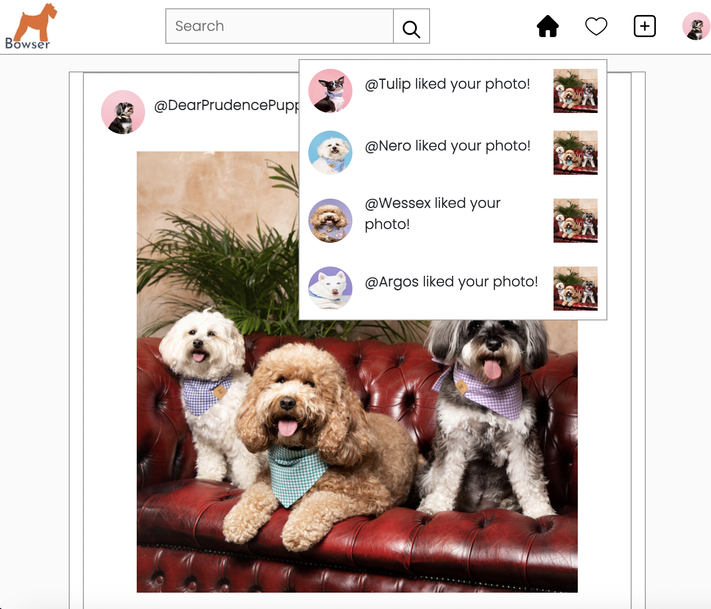

### Hi there 👋
* 👂 My name is Chantal
* 🔭 I’m currently working on a social media site project for dogs.
* 🌱 I’m currently learning Node & React
* ❤️ I love dogs!
* ⚡ Fun fact: I have a Miniauture Schnauzer named Prudence

## Project title
Bowser-Website

## Motivation
A social media website for dogs and other pets. Created with HTML, CSS and JavaScript

## Screenshots

<h2> 🚀 &nbsp;Some Tools I Have Used and Learned</h2>
<h2> 🚀 &nbsp;Some Tools I Have Used and Learned</h2>

## License
MIT © [ChantalSandal]()